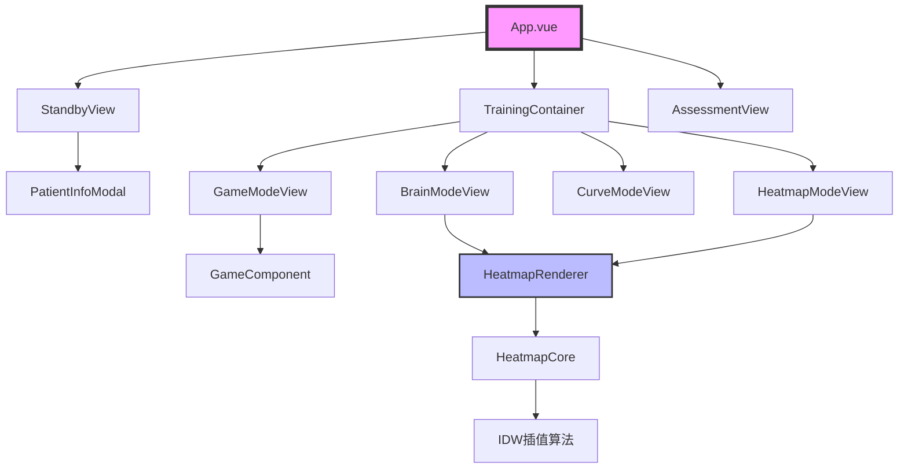

# 项目结构精简后可视化

## 🏗️ 精简后的项目结构

```
jz/
├── 📁 src/                        # 前端源代码
│   ├── 📄 App.vue                 # ⭐ 主应用控制器
│   ├── 📄 main.js                 # 应用入口
│   ├── 📁 assets/                 # 静态资源
│   │   ├── 📁 videos/            # 游戏视频资源
│   │   ├── 📁 images/            # 图片资源
│   │   └── 📁 styles/            # 样式文件
│   ├── 📁 components/             # Vue组件
│   │   ├── 📄 StandbyView.vue    # ⭐ 待机界面（三步骤流程）
│   │   ├── 📄 AssessmentView.vue # ⭐ 评估报告界面
│   │   ├── 📄 PatientInfoModal.vue # ⭐ 患者信息管理
│   │   ├── 📄 GameComponent.vue  # ⭐ 金币收集游戏（保留）
│   │   ├── 📁 training/          # ⭐ 训练核心模块
│   │   │   ├── 📄 TrainingContainer.vue # 训练容器
│   │   │   ├── 📁 modes/         # 训练模式
│   │   │   │   ├── 📄 BrainModeView.vue    # 专业大脑模式
│   │   │   │   ├── 📄 HeatmapModeView.vue  # 传统热力图
│   │   │   │   ├── 📄 CurveModeView.vue    # 数据曲线
│   │   │   │   └── 📄 GameModeView.vue     # 游戏模式
│   │   │   └── 📁 controls/      # 控制组件
│   │   │       ├── 📄 ModeSelector.vue     # 模式选择器
│   │   │       └── 📄 TrainingControls.vue # 训练控制
│   │   └── ❌ ObelabTrainingView.vue # [删除]
│   ├── 📁 utils/                 # ⭐ 工具库
│   │   ├── 📁 heatmap/           # 热力图渲染器
│   │   │   ├── 📄 HeatmapRenderer.js      # 主渲染器
│   │   │   ├── 📄 HeatmapCore.js          # 数据处理
│   │   │   ├── 📄 interpolation/idw.js    # IDW插值
│   │   │   └── 📄 colorMaps.js            # 颜色映射
│   │   └── 📄 fnirsLayout.js     # fNIRS布局
│   └── 📁 services/              # API服务
│       └── 📄 dataService.js     # 数据服务
│
├── 📁 fnirs_sdk/                 # ⭐ Python SDK（完整保留）
│   ├── 📄 __init__.py            # SDK入口
│   ├── 📄 processor.py           # 核心处理器
│   ├── 📄 algorithms.py          # 血氧算法
│   ├── 📄 data_encryption.py     # 数据加密
│   ├── 📁 processing/            # 数据处理
│   ├── 📁 config/                # 设备配置
│   │   └── 📁 device_profiles/   # 设备描述文件
│   │       ├── 📁 triangle/      # Triangle布局
│   │       ├── 📁 12node/        # 12节点配置
│   │       └── 📁 default_6node/ # 6节点配置
│   └── 📁 reports/               # 报告生成
│
├── 📁 backend/                   # 后端服务
│   ├── 📄 main.py               # 主服务器
│   └── 📄 database.py           # 数据库管理
│
├── 📁 dist/                      # 构建输出
│   └── 📁 config/               # 配置文件
│       └── 📄 triangle_layout.json
│
├── 📁 docs/                      # 精简后的文档
│   ├── 📄 heatmap-web-prd.md    # [保留] 产品需求
│   ├── 📄 golgi-web-software-heatmap-architecture.md # [保留] 架构
│   ├── ❌ SNOWBALL_*.md         # [删除] 游戏历史
│   ├── ❌ *test*.md             # [删除] 测试文档
│   └── ❌ phase8*.md            # [删除] 过期计划
│
├── ❌ extra_tool/                # [删除并备份] 测试工具
├── ❌ .playwright-mcp/           # [删除] 测试临时文件
├── ❌ test-results/              # [删除] 测试结果
├── ❌ test_screenshots/          # [删除] 测试截图
│
├── 📄 fnirs_data_server.py      # ⭐ fNIRS API服务器
├── 📄 package.json              # 前端配置
├── 📄 requirements.txt          # Python依赖
├── 📄 README.md                 # 项目说明
├── 📄 vite.config.js            # Vite配置
├── 📄 cleanup_project.bat       # [新增] Windows清理脚本
├── 📄 cleanup_project.py        # [新增] Python清理脚本
└── 📄 PROJECT_CLEANUP_GUIDE.md  # [新增] 清理指南

```

## 📊 组件依赖关系



## 🎯 核心模块说明

### 1. **待机界面 (StandbyView)**
- 患者信息登记
- 设备连接校验  
- 训练准备确认

### 2. **训练容器 (TrainingContainer)**
- 模式切换管理
- 数据流分发
- 状态同步

### 3. **四种训练模式**
- 🧠 **专业大脑模式**: Triangle布局的医学专业视图
- 🔥 **传统热力图**: 网格化的温度分布图
- 📊 **数据曲线**: ECharts实时数据可视化
- 🎮 **游戏模式**: 金币收集认知训练游戏

### 4. **热力图渲染引擎**
- 双Canvas分层渲染
- IDW反距离权重插值
- 自适应颜色映射
- 实时数据更新

### 5. **fNIRS SDK**
- 432通道数据处理
- Modified Beer-Lambert算法
- 血氧计算（HbO/HbR/HbT/SO2）
- 8Hz实时数据流

## ✅ 功能完整性检查

| 模块 | 状态 | 说明 |
|-----|------|-----|
| 患者管理 | ✅ | 完整保留 |
| 设备连接 | ✅ | SDK完整 |
| 专业大脑模式 | ✅ | Triangle布局 |
| 传统热力图 | ✅ | 网格热力图 |
| 数据曲线 | ✅ | ECharts图表 |
| 游戏模式 | ✅ | 金币收集游戏 |
| 评估报告 | ✅ | 训练结果分析 |
| 数据加密 | ✅ | SDK内置 |

## 🚫 已删除内容

| 内容 | 原因 | 影响 |
|-----|------|-----|
| Zone.Identifier | Windows系统文件 | 无影响 |
| extra_tool | 测试工具 | 无影响 |
| 测试临时文件 | 临时文件 | 无影响 |
| 游戏历史文档 | 过期文档 | 无影响 |
| ObelabTrainingView | 竞品参考 | 无影响 |

## 💡 维护建议

1. **定期清理**: 每月运行一次清理脚本
2. **文档管理**: 重要文档移至专门的文档仓库
3. **测试管理**: 使用CI/CD，避免本地测试文件累积
4. **版本控制**: 精简前后都要做好Git提交