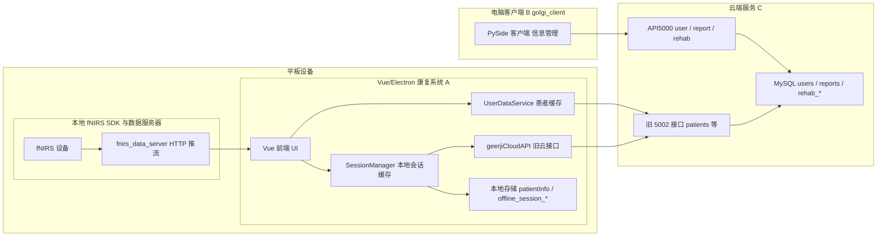
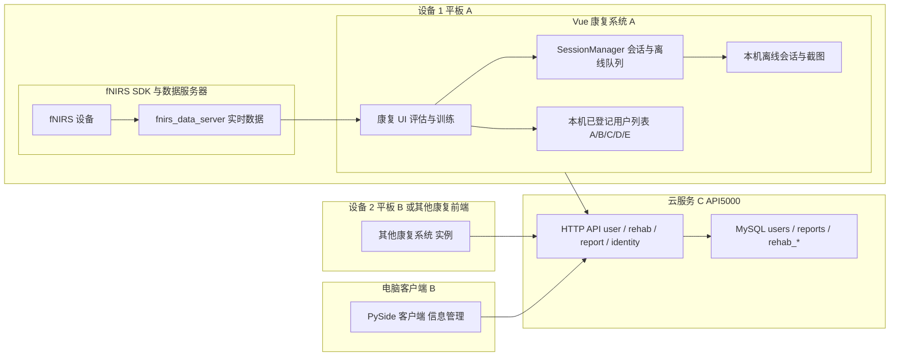

## 康复系统与客户端的当前架构（现状视图）

```mermaid
flowchart LR
  subgraph Device["平板设备"]
    subgraph RehabApp["Vue/Electron 康复系统 A"]
      UI["Vue 前端 UI"]
      SM["SessionManager 本地会话缓存"]
      UDS["UserDataService 患者缓存"]
      CloudAPI["geerjiCloudAPI 旧云接口"]
      LocalStore["本地存储 patientInfo / offline_session_*"]
    end
    subgraph SDK["本地 fNIRS SDK 与数据服务器"]
      DeviceHW["fNIRS 设备"]
      FnirsServer["fnirs_data_server HTTP 推流"]
    end
  end

  subgraph Cloud["云端服务 C"]
    API5000["API5000 user / report / rehab"]
    API5002["旧 5002 接口 patients 等"]
    DB["MySQL users / reports / rehab_*"]
  end

  subgraph PCClient["电脑客户端 B golgi_client"]
    PySide["PySide 客户端 信息管理"]
  end

  DeviceHW --> FnirsServer
  FnirsServer --> UI

  UI --> SM
  SM --> LocalStore
  UI --> UDS
  SM --> CloudAPI

  UDS --> API5002
  CloudAPI --> API5002

  PySide --> API5000
  API5000 --> DB
  API5002 --> DB

  %% 说明：Vue 康复系统当前主要通过旧 5002 协议与云交互，尚未完全对齐 5000 端口 API；
  %% 云端 5000/5002 与电脑客户端共用同一批用户/报告/rehab 表，但前端之间彼此不直接通信。

```

---

## 终版目标：以单台设备为中心的康复系统视图（与其他系统解耦）

```mermaid
flowchart LR
  subgraph Cloud["云服务 C API5000"]
    API["HTTP API user / rehab / report / identity"]
    DB["MySQL users / reports / rehab_*"]
    API --> DB
  end

  subgraph TabletA["设备 1 平板 A"]
    subgraph RehabA["Vue 康复系统 A"]
      UIA["康复 UI 评估与训练"]
      SMA["SessionManager 会话与离线队列"]
      LocalUsersA["本机已登记用户列表 A/B/C/D/E"]
      LocalDataA["本机离线会话与截图"]
    end
    subgraph SDKA["fNIRS SDK 与数据服务器"]
      DevA["fNIRS 设备"]
      ServerA["fnirs_data_server 实时数据"]
    end
  end

  subgraph TabletB["设备 2 平板 B 或其他康复前端"]
    RehabB["其他康复系统 实例"]
  end

  subgraph PC["电脑客户端 B"]
    ClientB["PySide 客户端 信息管理"]
  end

  DevA --> ServerA --> UIA

  UIA --> SMA
  UIA --> LocalUsersA
  SMA --> LocalDataA

  RehabA --> API
  RehabB --> API
  ClientB --> API

  %% 本机已登记用户列表表示：一台平板上历史登录过的用户集，下次可直接在康复系统里选择继续使用
  %% 云端只作为备份和跨设备找回；设备之间互不直接通信

```
