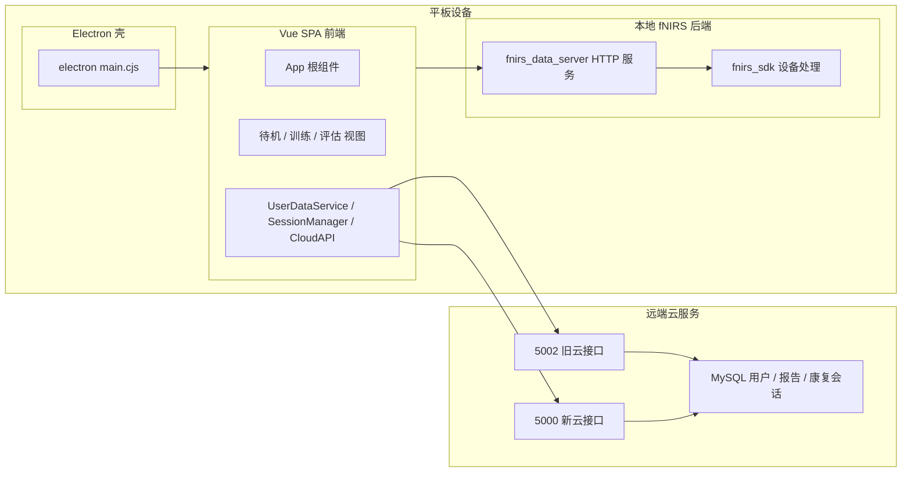
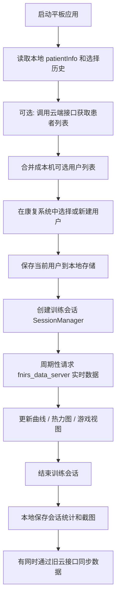

## 戈尔基康复系统整体架构（现状链路整理）

> 范围：只看“康复系统”这条链路——平板上的 Electron+Vue 前端、本地 fNIRS 后端（fnirs_data_server + fnirs_sdk），以及当前接入的云服务（5002 旧云 + 5000 新云）。

---

## 1. 组件视图：前端 / 本地后端 / 云端

### 1.1 Electron 壳层

- `electron/main.cjs`：
  - 启动打包后的本地 fNIRS 后端可执行（基于 `fnirs_data_server.py` / `fnirs_sdk`）。
  - 创建 `BrowserWindow`，加载 `dist/index.html`，承载前端 Vue SPA。
  - 进程退出时负责关闭本地后端进程。

### 1.2 Vue 前端（康复 UI）

- 入口：`src/main.js` → `App.vue`。
- 主要职责：
  - 待机视图：患者选择与新患者登记（`SearchableUserSelect` + `PatientInfoModal`）。
  - 训练视图：曲线、热力图、游戏等模式（`TrainingContainer` + 各种 mode view）。
  - 评估视图：训练总结、截图、简单报告展示（`AssessmentView`）。
  - 前端服务层：
    - `UserDataService`：用户列表 / 搜索 / 本地缓存（当前走 5002 `/api/patients`）。
    - `SessionManager`：训练会话生命周期、本地缓冲、云端实时上传开关。
    - `geerjiCloudAPI`：旧云 API 客户端（5002 `/api/upload/data`）。
    - `apiClient` / `apiAuth` / `errorHandler`：带重试 / 签名 / 错误分类的 HTTP 客户端。

### 1.3 本地 fNIRS 后端

- `fnirs_data_server.py`：
  - 通过 `FNIRSDataServer` 封装 `fnirs_sdk`，连接真实设备或生成模拟数据。
  - 暴露本地 HTTP 接口（如 `/api/fnirs/data`）供前端周期性轮询获取 432 通道数据。
- `fnirs_sdk`：
  - 完成原始光强→OD→HbO/HbR 的完整处理链路，支持多种节点布局与配置。

### 1.4 云服务（当前双轨并存）

- 5002 旧云：
  - 当前前端仍主要使用：
    - `/api/patients`：患者列表 / 详情 / 新建（UserDataService 假定存在）。
    - `/api/upload/data`：多种 `data_type`（patient_profile / training_session / hbo_batch / screenshot）。
  - 前端 `geerjiCloudAPI` + `apiClient` 默认指向 `http://36.134.11.254:5002`。

- 5000 新云：
  - 统一的用户和康复会话中心（`/api/user/*`, `/api/report/*`, `/api/rehab/*`）。
  - 当前康复前端尚未真正对接（仅在 specs 下有完整说明 & 备份代码）。

---

## 2. 典型训练链路：从“选用户”到“结束训练”（现状）

### 2.1 用户选择与“本机已登记用户列表”

- 入口：待机界面中的 `SearchableUserSelect` 组件。
- 数据来源：
  - 云端用户列表（当前：`UserDataService.getAllPatients()` → 5002 `/api/patients`）。
  - 本地当前用户快照：`localStorage.patientInfo` + `current_patient_id`。
  - 本地最近选择历史：`UserSelectionHistory`（只记录最近选过的若干 ID）。
- 现状特点：
  - 已经有“合并本地当前用户到远端列表”的逻辑，避免云端暂未同步时丢失当前患者。
  - 但“本机完整用户表”尚未抽象出来：
    - 当前代码更像是“云端用户 + 一个当前本地用户 + 若干最近使用 ID”。
    - 还不是你设想的“这台平板上的 A/B/C/D/E 全量本地用户列表”的一等公民结构。

### 2.2 患者信息登记与本地状态

- 新建或编辑患者时：
  - 前端在表单中维护结构化患者信息（姓名、性别、年龄、诊断等）。
  - 本地会更新：
    - `localStorage.patientInfo`：当前患者详细信息。
    - `localStorage.current_patient_id`：当前患者 ID（可能是 `LOCAL_*` 或 `PATIENT_*`）。
  - 云端部分：
    - 现在主要通过 `UserDataService.createPatient` 或 `geerjiCloudAPI.uploadPatientProfile` 走 5002 协议。
    - 对 5000 的 `/api/user/register` 还没有真正接入。

### 2.3 训练会话生命周期（SessionManager）

- `SessionManager.startSession(trainingMode, options)`：
  - 检查是否有未结束会话，必要时先强制结束。
  - 读取 `current_patient_id`，若缺失则报错提示“请先登记患者”。
  - 为每次训练生成一个新的 `SESSION_...` 会话 ID，记录模式、开始时间等。
  - 根据 `cloudMode`（默认 `disabled`）：
    - `realtime` 模式下尝试通过旧云 `createTrainingSession` 创建云端会话（5002 `/api/upload/data` with data_type=training_session）。
    - 若失败，则退回到本地离线模式。
  - 在内存中与 `localStorage.current_session` 中保存当前会话元信息。

- 实时数据采集：
  - 前端 `App` 定时从 `fnirs_data_server` 轮询数据接口（如 `/api/fnirs/data`）。
  - 将结果填入 `hboData / hbrData / dataHistory / currentValues`，驱动曲线和热力图渲染。
  - 关键点：这一链路完全本地，不依赖云端是否可用。

- 会话内数据统计与上传：
  - 每次调用 `SessionManager.addHBODataPoint` 都会更新本地统计信息（总点数、均值、最大最小值、质量评分等）。
  - 若 `cloudEnabled` 为真且缓冲区达到批量阈值，则调用 `geerjiCloudAPI.uploadHBODataBatch` 推送一批 HBO 数据到旧云。
  - 离线或云未启用时，只在本地累积，不做上传。

- `SessionManager.endSession`：
  - 标记会话结束时间与状态，停止批量上传定时器。
  - 生成本地训练总结对象（统计信息、模式、开始结束时间等），写入 `localStorage`（如 `training_record_*`）。
  - 若配置开启云端同步，则通过 `geerjiCloudAPI.completeTrainingSession` 上报会话结束信息。

### 2.4 评估与截图上传

- 评估视图中通过 `html2canvas` 截取评估界面或关键图表生成 PNG。
- 现状云端路径：
  - `geerjiCloudAPI.uploadScreenshot` 使用 5002 `/api/upload/data`，`data_type = screenshot`。
  - 截图被附着在当前云端会话 ID 上，作为一种轻量报告。
- 本地路径：
  - 评估结果与截图路径也会落到本地存储，对离线和本机回看提供支撑。

---

## 3. 数据与状态存储结构（本地视角）

### 3.1 浏览器 / Electron 渲染进程内存

- App 全局状态：
  - `appState`：当前 UI 状态（待机 / 训练 / 评估 / 错误等）。
  - `patientInfo`：当前患者信息（对象）。
  - `currentSession`：当前训练会话元信息（对象）。
  - `hboData / hbrData / dataHistory / currentValues`：实时与历史数据缓存。
  - 训练与评估相关统计：`trainingSummary`、评估结果等。

### 3.2 localStorage 中的关键键值

- 患者相关：
  - `patientInfo`：最新一次编辑后的当前患者信息。
  - `current_patient_id`：当前患者 ID（可为本地前缀 `LOCAL_`）。

- 会话相关：
  - `current_session`：最近一次正在进行或刚结束的会话信息。
  - `offline_session_*`：离线会话队列（尚未统一抽象为一个队列管理器）。

- 评估 / 报告相关：
  - 若干 `training_record_*` 键：训练记录与评估结果快照。

- 云配置：
  - `cloud_mode`：`disabled` 或 `realtime`，控制是否尝试实时云上传。

> 现状中，本地存储已经承担了“离线兜底”和“这台平板的历史记录”的一部分职责，但结构偏散。

---

## 4. 架构复杂度观察与后续整理方向（仅做归纳，不改代码）

1. **云端接口双轨并存**：
   - 代码层面同时存在 5002 与 5000 两套接口描述，但实际前端只对 5002 有真实调用。
   - 文档和代码的意图是逐步迁移到 5000（统一 `users / reports / rehab_*`），但目前仍然是“设计已在 specs，实现仍在旧云”状态。

2. **本机用户管理抽象不足**：
   - 现有实现通过 `patientInfo` + `current_patient_id` + `UserSelectionHistory` 拼出一个“看起来”的本机常用用户列表。
   - 距离“这台平板的 A/B/C/D/E 用户表”（可以持久化、可维护、与云端 user_id 有明确映射）还差一个专门的本机用户管理层。

3. **会话与数据上传路径分散**：
   - `SessionManager` 管一部分状态与实时上传，评估视图再做一次截图上传，部分逻辑散落在组件中。
   - 与 5000 的 `rehab_sessions` / `rehab_fnirs_records` / `rehab_session_reports` 目标结构尚未统一抽象到一个“RehabCloudService” 或类似中心类中。

4. **本地与云的边界略显模糊**：
   - 从现状链路看，很多地方是“能连上云就多做一步”的风格，本地与云的职责划分还不够清晰。
   - 你提出的“每台设备只需要知道本机用户列表 + 云端备份”的思路，可以作为后续重构的指导边界：
     - 本机：确保 A/B/C/D/E 这种“本机已登记用户列表”是真正落地且可持续维护的；
     - 云端：只作为统一的 `user_id` / `rehab_sessions` / 报告归档中心。

本文件只对现状链路做结构化整理，方便后续在重构时对照“现有行为 vs 目标行为”，逐步迁移，而不是一次性大改。
